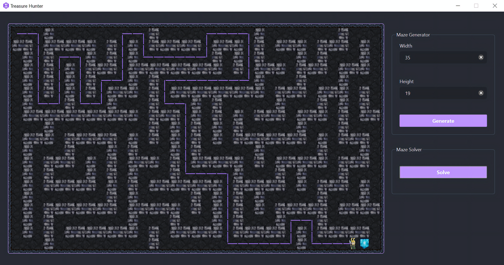

# Treasure Hunter
Treasure Hunter is maze solving application written in Python. This app randomly creates and visualises the maze of the given dimensions and solves it using **BFS** algorithm.




## Getting Started

- **Install Python**
     - Download the python 3.9.x installer from [python.org](https://www.python.org)
     - Install the downloaded installer and be sure to check the "_Add Python 3.x to PATH_" checkbox
      
        
      
- **Get the code**
  ```
  git clone https://github.com/ayush9304/Treasure-Hunter
  ```
      
- **Install Python dependencies**
    ```
    pip3 install -r requirements.txt
    ```

- **Run the application**
    - For Windows
      ```
      py main.py
      ```
    - For Mac/Linux
      ```
      python3 ./main.py
      ```

## License

Licensed under the MIT License.
